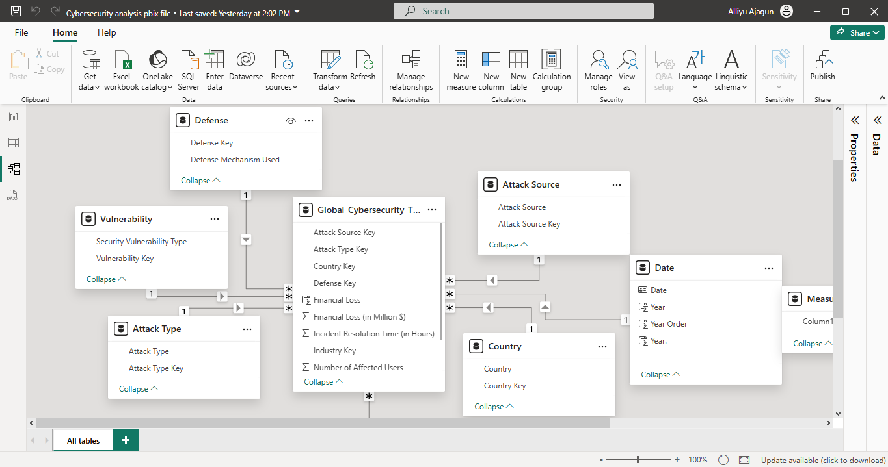
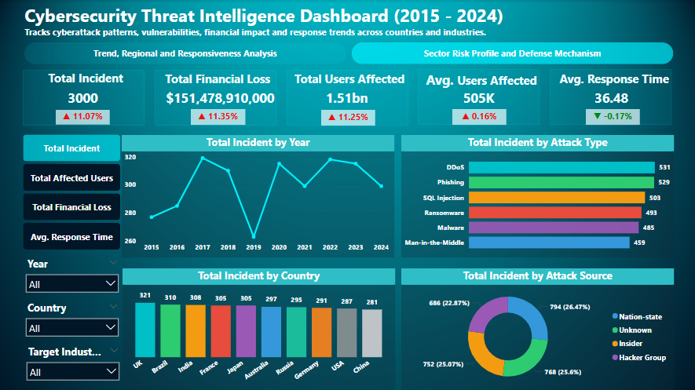

# Cybersecurity-Intelligence
A visual deep dive into global cybersecurity trends, threats and response strategies using Power BI

Global cybersecurity losses hit $151.48 billion across 3,000 incidents affecting 1.51 billion users between 2015 and 2024, and I wanted to know whether defenses were keeping pace. Using a Kaggle dataset modeled as a star schema in Power BI, I tracked incident volume, financial impact, attack types, and response time by country. The finding that matters most: threat volume and financial cost are rising faster than response times are improving; average response time sits at 36.5 hours, and the UK, despite being a top target, still leads in both attack volume and financial loss.

### The Business Problem

IT security leaders and decision-makers need a clear, data-driven view of how cyber threats have evolved. Which sectors and countries are hit hardest, which attack types cause the most damage, and whether current response capabilities are actually improving, to prioritize defense investment.

### Data & Method

- Source: Kaggle global cybersecurity threats dataset (2015–2024)
- Cleaning: Power Query Editor
- Modeling: star schema with a dedicated date table and DAX measures
- Analysis focus: incident frequency, financial losses, user exposure, attack vectors, source attribution, response efficiency by country

### Key Insights

* "Incidents peaked at 320/year in 2020 and 2022, before easing slightly in 2024 as detection improved" - a volume trend tied to a plausible cause, not just a line going up.
* "2017 was the costliest year on record at $16 billion in losses, despite a dip in the years that followed" - impact and frequency don't move in lockstep.
* "IT ($25B) and Banking/Finance ($23B) absorb the largest sector losses because they hold the most sensitive data" - names the mechanism, not just the ranking.
* "DDoS ($28B) and Phishing ($27B) are the costliest attack types, ahead of SQL Injection and Ransomware" - prioritizes where mitigation budget should go first.
* "The UK has both the highest attack volume and the highest financial loss ($16.5B) among all countries tracked" - a single country carrying disproportionate risk.
* "Average response time is 36.5 hours and improving only slightly; threat severity is outpacing defensive gains" - the report's central thesis, stated as a finding rather than a description.

### Clear Recommendations

* Strengthen internal controls - user behavior analytics, stricter identity/access policies, more frequent digital audits.
* Deploy targeted mitigation for the costliest attack types: cloud-based DDoS protection and recurring phishing-simulation training.
* Adopt automated, real-time response, SOAR platforms and AI-based anomaly detection - to close the response-time gap.
* Invest in attribution and visibility through digital forensics tools and threat-intelligence platforms.
* Join international cybersecurity information-sharing alliances, since losses are distributed globally with no "safe zone."

Links: [Live dashboard](https://app.powerbi.com/view?r=eyJrIjoiNzMwZTNjZDItMjFhYy00OTM2LWI4MWEtNGZlMmI5MzAyODE0IiwidCI6ImI2NDU3ZDY4LTQzODgtNGMzYS04MjIyLTc0ZGU0NDU5ZDFlZiJ9) · [Medium report](https://medium.com/@ajagunalliyu/cybersecurity-intelligence-visualization-using-power-bi-b4efdb6f04e5?sharedUserId=ajagunalliyu)

## Let's Connect
 
> Feel free to reach out: [ajagunalliyu@gmail.com](mailto:ajagunalliyu@gmail.com)  
> Connect with me on [LinkedIn](https://www.linkedin.com/in/alliyuajagun)  
> Follow on [Twitter/X](https://x.com/Sayyid_Alliyu)  
> Read more on [Medium](https://medium.com/@ajagunalliyu)  
> 💻 Explore more projects on [GitHub](https://github.com/ajagunalliyu)
> View [Portfolio website](https://alliyutheanalyst.lovable.app/)

## ⭐ Support

If you found this project helpful or interesting, consider giving the repository a **star**. Your support helps increase the visibility of my work and encourages me to continue building and sharing data analytics projects.

Thank you for visiting!

